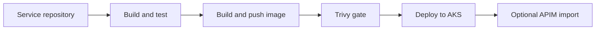

# Reusable GitHub Actions for Azure Delivery

[](https://docs.github.com/actions)
[](https://azure.microsoft.com/)
[](https://trivy.dev/)
[](https://ahmed-el-mahdy.github.io/)

Reusable workflow building blocks for .NET services delivered through Azure Container Registry, AKS, Kustomize, and API Management.

## What This Repository Demonstrates

- Build, test, and coverage collection for configurable .NET projects.
- Docker image build and ACR publication with branch, environment, and commit tagging.
- HIGH and CRITICAL image vulnerability gating with Trivy.
- AKS authentication, Kustomize-based deployment, rollout verification, and diagnostic output.
- Optional OpenAPI import into APIM after deployment.
- One orchestration workflow that maps protected branches to environment-specific GitHub variables.

## Pipeline



## Available Workflows

| Workflow | Responsibility |
| --- | --- |
| `.github/workflows/build-test.yml` | Restore, build, test, and upload Cobertura coverage |
| `.github/workflows/docker-build-push.yml` | Authenticate to Azure, publish to ACR, and scan the image |
| `.github/workflows/deploy-aks.yml` | Render/apply a Kustomize overlay and verify the rollout |
| `.github/workflows/apim-import.yml` | Wait for the OpenAPI endpoint and import it into APIM |
| `.github/workflows/full-pipeline.yml` | Orchestrate the complete branch-to-environment flow |

## Caller Example

Create a workflow in the consuming service repository:

```yaml
name: Service delivery

on:
  push:
    branches: [dev, qa, staging, prod]

jobs:
  delivery:
    uses: ahmed-el-mahdy/github-actions-reusable-workflows/.github/workflows/full-pipeline.yml@main
    with:
      dotnet-version: "8.0"
      project-path: "src/MyService.API/MyService.API.csproj"
      test-path: "tests/MyService.Tests/MyService.Tests.csproj"
      docker-context: "."
      dockerfile: "Dockerfile"
      service-name: "my-service"
      k8s-overlay-path: "k8s/overlays"
      enable-apim-import: false
    secrets: inherit
```

[`examples/caller-workflow.yml`](examples/caller-workflow.yml) contains a fuller example with optional APIM inputs.

## Required Configuration

The caller must define environment-specific GitHub variables for AKS and APIM plus one shared ACR login server.

| Variable pattern | Example |
| --- | --- |
| `ACR_LOGIN_SERVER` | `myplatformacr.azurecr.io` |
| `AKS_CLUSTER_NAME_<ENV>` | `platform-dev-aks` |
| `AKS_RESOURCE_GROUP_<ENV>` | `platform-dev-rg` |
| `APIM_NAME_<ENV>` | `platform-dev-apim` |
| `APIM_RESOURCE_GROUP_<ENV>` | `platform-dev-rg` |

Each called deployment workflow expects an `AZURE_CREDENTIALS` secret. Prefer GitHub OIDC with a federated Azure identity for production; the current credential input keeps the example compatible with service-principal JSON.

## Operational Guardrails

- Protect `qa`, `staging`, and `prod` through GitHub Environments and required reviewers.
- Pin reusable workflow references to a release tag or commit SHA in production consumers.
- Pin third-party Actions to reviewed versions or SHAs and keep them updated with Dependabot.
- Use immutable image tags for promotion; treat `<environment>-latest` only as a convenience pointer.
- Ensure the OpenAPI URL is reachable from the runner before enabling APIM import.

## Validation

These files must remain under `.github/workflows` for GitHub to register `workflow_call` entry points. Before release, parse the YAML, review required inputs, and test from a non-production caller repository with least-privilege Azure access.

## Status

This is a reusable delivery pattern library. It requires repository variables, Azure identities, a compatible service Dockerfile, and matching Kustomize overlays in the caller.
